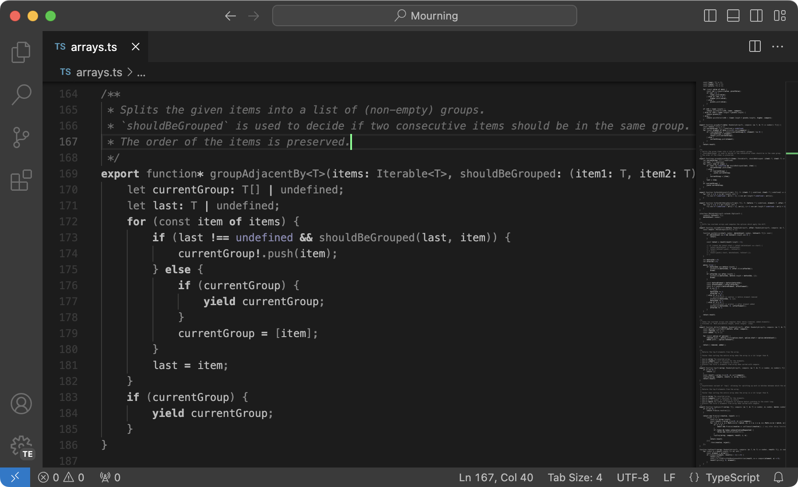

# Mourning

A minimal, mostly monochrome dark theme.

Install from the vscode extensions marketplace, or locally via:

    pnpm install
    pnpm run dist
    code --install-extension mourning-*.vsix
